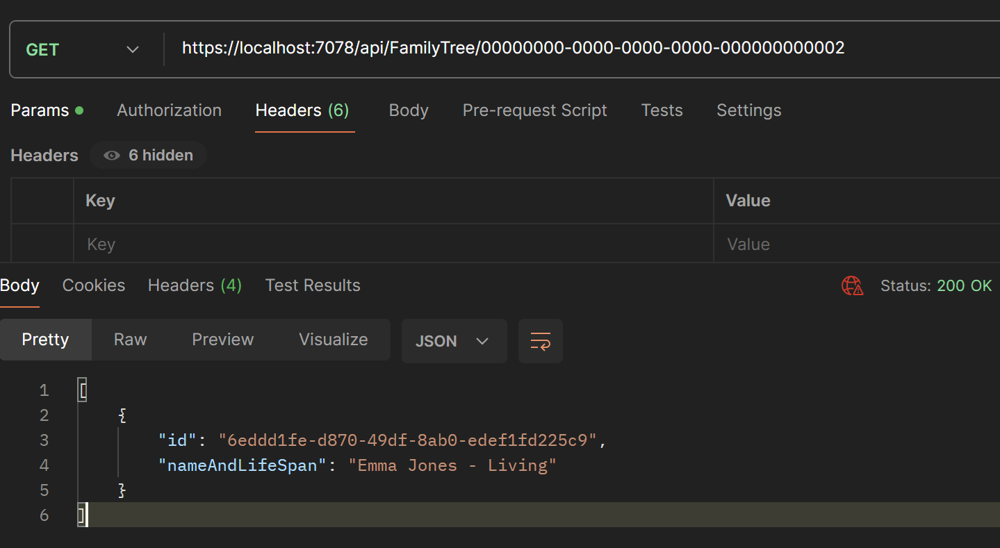
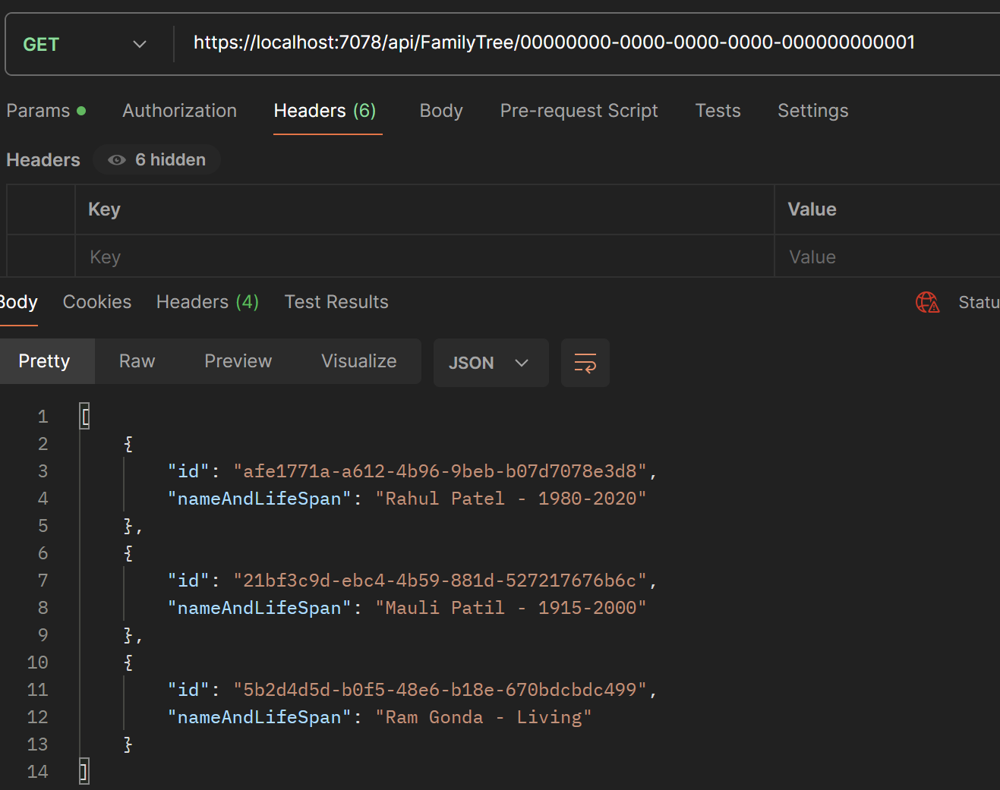
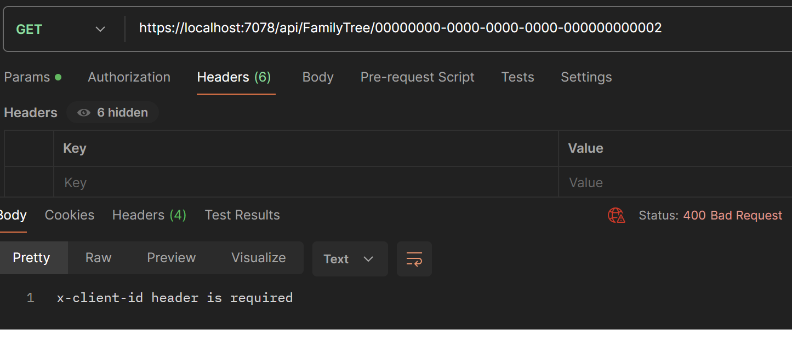

# FamilyTreeAPI

Created controller FamilyTreeController and method GetFamilyTreePeople.

Clone the repository and run the Application in Visual Studio Code.

API Endpoint: https://localhost:7078/api/FamilyTree/00000000-0000-0000-0000-000000000001

Following is the output,

